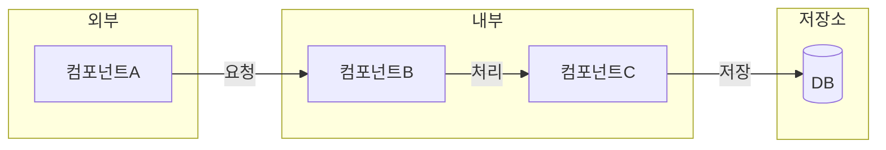

# 아키텍처 문서 템플릿

핵심 질문: **"어떤 컴포넌트가 존재하고 어떻게 연결되는가?"**

시간 순서가 아니라 구성 요소 간의 관계와 경계를 다룬다.
다이어그램은 `flowchart` 또는 `graph`가 기본이다. 컴포넌트 그룹이 있으면 `subgraph`로 묶는다.

## 출력 구조

````markdown
# {시스템명} 아키텍처

> 한 줄 요약: {이 시스템의 구성과 역할을 한 문장으로}

## 구성도



## 컴포넌트 상세

### {컴포넌트명}
- **역할**: {이 컴포넌트가 하는 일}
- **입력**: {무엇을 받는지}
- **출력**: {무엇을 내보내는지}
- **통신 방식**: {HTTP, gRPC, 메시지 큐 등}

### {컴포넌트명}
...

## 통신 구조

| 출발 | 도착 | 방식 | 데이터 |
|------|------|------|--------|
| {컴포넌트A} | {컴포넌트B} | {HTTP/gRPC/큐} | {전달 내용} |

## 경계와 영역

| 영역 | 포함 컴포넌트 | 담당 |
|------|--------------|------|
| {영역명} | {컴포넌트 목록} | {담당 팀 또는 역할} |

## 의존성

| 대상 | 용도 | 장애 시 영향 |
|------|------|-------------|
| {외부 시스템} | {왜 필요한지} | {장애 시 어떻게 되는지} |
````

## 정보 요청 예시

기본 질문:
`문서화할 시스템명과 핵심 기능을 알려주고, 어떻게 출력하면 되는지와 시스템을 파악할 수 있는 문서, 코드, 설정 경로를 보내줘.`

추가 질문:
`구성 컴포넌트, 통신 방식, 외부 의존성을 확인할 수 있는 경로를 추가로 알려줘.`

## 작성 포인트

- `subgraph`로 컴포넌트를 논리적 영역(내부/외부, 팀 경계, 네트워크 영역 등)별로 묶는다.
- 컴포넌트 상세는 입력/출력 중심으로 쓴다. 내부 동작 방식은 다루지 않는다.
- 통신 구조 테이블은 다이어그램의 화살표를 보충한다. 다이어그램에 담기 어려운 통신 방식, 프로토콜 정보를 여기에 적는다.
- 경계와 영역 섹션은 팀 간 책임 구분이 있을 때만 포함한다. 없으면 생략한다.
- 다이어그램 시각화가 필요하면 `mmdc`(mermaid-cli)를 사용한다. `mmdc`가 설치되지 않은 환경이면 Mermaid 코드 블록만 제공한다.
