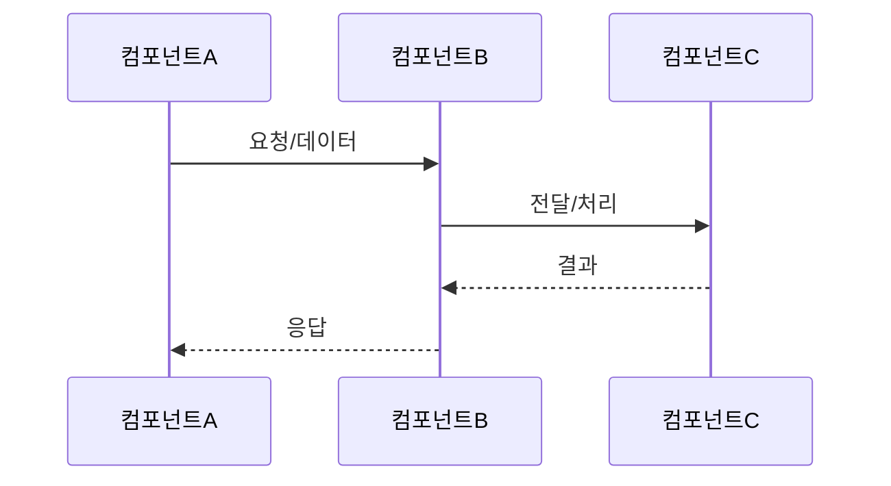

# 플로우 문서 템플릿

핵심 질문: **"데이터가 어디서 어디로 흘러가는가?"**

시간 순서대로 요청이 시작되어 결과가 도착하기까지의 경로를 다룬다.
다이어그램은 `sequenceDiagram`이 기본이다. 분기가 많으면 `flowchart`를 사용한다.

## 출력 구조

````markdown
# {시스템명}

> 한 줄 요약: {이 시스템이 하는 일을 한 문장으로}

## 전체 흐름



## 흐름 상세

### 1단계: {단계명}
- **트리거**: {이 단계가 시작되는 조건}
- **동작**: {어떤 컴포넌트가 무엇을 하는지}
- **결과**: {다음 단계로 넘어가는 출력}

### 2단계: {단계명}
- **트리거**: ...
- **동작**: ...
- **결과**: ...

## 주요 컴포넌트

| 컴포넌트 | 역할 | 통신 대상 |
|----------|------|-----------|
| {이름} | {한 줄 역할} | {통신 대상} |

## 에러 흐름

| 상황 | 처리 |
|------|------|
| {실패 시나리오} | {처리 방식} |

## 의존성

| 대상 | 용도 | 장애 시 영향 |
|------|------|-------------|
| {외부 시스템} | {왜 필요한지} | {장애 시 어떻게 되는지} |
````

## 정보 요청 예시

기본 질문:
`문서화할 시스템명과 핵심 기능을 알려주고, 어떻게 출력하면 되는지와 시스템을 파악할 수 있는 문서, 코드, 설정 경로를 보내줘.`

추가 질문:
`메인 요청 흐름과 예외 처리를 확인할 수 있는 경로를 추가로 알려줘.`

## 작성 포인트

- 다이어그램의 participant 순서는 **흐름이 왼쪽에서 오른쪽으로 진행**되도록 배치한다.
- 흐름 상세의 단계 수는 메인 플로우 기준으로 구성한다. 분기나 예외는 에러 흐름에서 다룬다.
- 비동기 흐름이 있으면 다이어그램에서 점선 화살표(`-->>`)로 구분한다.
- 다이어그램 시각화가 필요하면 `mmdc`(mermaid-cli)를 사용한다. `mmdc`가 설치되지 않은 환경이면 Mermaid 코드 블록만 제공한다.
